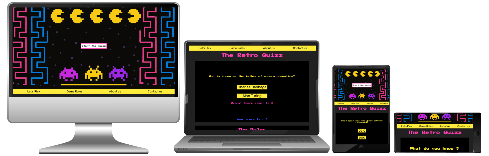

# The-Retro-Quizz

## Description :

**The Retro Quizz** is a fun, interactive website for **enthusiasts of video game and technology history**. The quiz focuses on video games, consoles, and programming through the decades. Designed with a nostalgic, neon-colored, pixelated style, the site evokes the classic aesthetic of old-school arcade games, inviting users to relive their earliest tech memories.

The goal is not just to test knowledge but to **bring together people with shared interests** and form a vibrant community. Social media links help users to stay connected, and future updates will include chat rooms, and events.

## Business Goal :

The primary goal of The Retro Quizz is to **build a community of retro tech and video game lovers**.   
To achieve this, we aim to:
- Provide a fun, engaging quiz experience.
- Attract traffic through social media integration.
- Encourage user interaction with future features such as:
    - Chatrooms
    - Real-life events
- Eventually introduce monetization through targeted advertisements.

## Target audiance :

- Adults aged 30 to 50, who grew up with the early generations of video games.
- Individuals working in or passionate about technology.
- Fans of retro gaming culture.
- Younger users drawn to nostalgic and vintage aesthetics.

## Features :

- **Start Screen** : Fullscreen (for horizontal screens) retro-style welcome screen with a central button and a Pac-Man-inspired background. To remind of a video game welcome screen. 

- **Navigation Bar** : To facilitate navigation throughout the page thanks to links to key sections : Game Window, Rules, About Us, and Contact. 

- **Game Window** : The interactive quiz begins here when users click a "Start the Quizz" button. 

- **Rules Section** : Simple game instructions with a motivational message to get users excited. 

- **About Us** : An introduction to the creators and the passion and goal behind the project. 

- **Contact Us** : Email and social media links for user interaction and feedback. 

## Performance & Validation :

 - Lighthouse Performance Results: (to be added)
- [Pass the CSS Validation: W3C validator](https://jigsaw.w3.org/css-validator/validator?uri=https%3A%2F%2Fsaraelizalde.github.io%2FThe-Retro-Quizz%2F&profile=css3svg&usermedium=all&warning=1&vextwarning=&lang=fr)
- [Pass the HTML Validation: W3C validator](https://jigsaw.w3.org/css-validator/validator?uri=https%3A%2F%2Fsaraelizalde.github.io%2FThe-Retro-Quizz%2F&profile=css3svg&usermedium=all&warning=1&vextwarning=&lang=fr)
- Pass the JavaScript Validation: [JSHint](https://jshint.com/) with no significant issues

## Futur features :

- Monetization : Introduce ads to generate revenue and support site growth.
- Forum & Chatrooms : Niche topic chatrooms (e.g. rare games, console debates).
- Events Section : Announce real-life meetups for the community.
- Quiz Levels : Add difficulty levels for returning users.

## Technology used : 

- HTML5
- CSS3
- JavaScript

## Deployment :

- [Live Website URL](https://saraelizalde.github.io/The-Retro-Quizz/)
- [Repository Clone Link](https://github.com/saraelizalde/The-Retro-Quizz.git)

## Development Process :
- I created a wireframe on paper to have a clear idea of what structure to build.
- I built the initial HTML body structure and its responsive layout.
- I started styling the page with pixelated and retro fonts and settled on a color palette of black and neon colors.
- Once I started working on the JavaScript code, I had to change a few elements in the HTML within the game window. I deleted the answer buttons so they could appear dynamically through JavaScript, and I added IDs to them for styling.
- I struggled to find a way to randomize the position of the correct answer (so it wouldn’t always be answer A). I tried using the modulo operator (%) for a while but eventually settled on using Math.random().
- I tested multiple methods to loop through the questions and answers in the array, and ultimately implemented a currentQuestion++ mechanism at the end of my function to prevent the questions from repeating too frequently — especially given the relatively small size of the array. In the future, once there are more questions available, I plan to update this logic to randomly generate questions instead of following the array’s order.
- I added a temporary end condition to make testing easier, so I wouldn’t have to answer 10 correct questions every time but only 2.
- I then fixed the score display and score value, as the score section on the page was not updating with correct answers.
- When I replaced the alert for a wrong answer with a native on-screen message, I struggled with the message repeating every time a wrong answer was given and not disappearing after a correct answer. Eventually, I solved it by adding an if statement to check if the feedback-message element exists, and if it does, I remove it. I also had to create a new variable to reference it.
- I wanted to move my array of questions into a separate questions.json file to keep my JavaScript cleaner and more organized. However, I ran into several issues while implementing this:
    - 1. Incorrect File Path : 
    At first, my fetch request wasn’t working because the file path to the JSON was incorrect. After correcting the path to match the actual project structure (assets/data/questions.json), the file was found, but I still couldn’t get the data to load.
    - 2. Nothing Logging to Console :
    I added console.log() statements throughout my code to debug, but nothing was appearing in the browser console. This made it hard to tell where the problem was.
    - 3. Accessing Data Before It Was Loaded :
    I was trying to access questions.length and generate a random index before the data from questions.json was fully fetched. This caused errors.
    Fix: I moved the logic for using the data (like setting currentQuestion) inside the .then() block, after the data was successfully received.
    - 4. Opening the HTML File Directly :
    I was testing the app by opening the HTML file directly in the browser (using file://). I didn’t realize that the fetch() API doesn’t work in this case due to browser security restrictions.
    Fix: I switched to running a local server.
    - 5. Variable Not Declared in Time :
    Another issue was using the questions array before it was declared. I made sure to declare it (let questions = [];) before using or assigning values to it.

## Credit :

- The background image in the start-area was generated by Chat GPT
- The questions and texts were generated or formulated with the help of Chat GPT
- The icons in the footer were taken from <a href="https://fontawesome.com/" target="_blank">Font Awesome</a>
- The favicons were made with <a href="https://favicon.io/" target="_blank">Favicon.io</a>
- The <a href="https://www.npmjs.com/package/canvas-confetti" target="_blank">confetti annimation</a> is from JS library by @catdad.